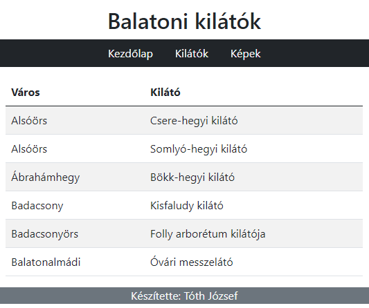

# Dolgozat

## Előkészületek

* Készítsen egy forkot erről a repositoryról!
* A másolatot klónozza le a saját számítógépére!
* Ebben a másolatban dolgozzon, és a módosításokat töltse fel a GitHub-ra!
* A végén a GitHub repository címét adja be!

## 1. feladat

Készítsen egy formot, amelyen neveket és pontszámokat lehet megadni a minta szerint!

Az alkalmazást kizárólag Bootstrap használatával formázza!

A névnek legalább 3 karakter hosszúnak kell lennie. Ha rövidebb, akkor jelenjen meg a "A név nem lehet 3 karakternél rövidebb!" hibaüzenet!

A pont értéke 1 és 100 között lehet. Ezt olyan beviteli mezővel valósítsa meg, amelybe csak számokat lehet beírni! Ha a beírt pont a határokon kívül van, akkor jelenjen meg a "A pont 0 és 100 közötti szám lehet!" hibaüzenet!

Ha jók az adatok, akkor a Hozzáadás gomb megnyomásakor adja hozzá őket a listához! Azoknak a vizsgázóknak az adatai, akik nem érték el az 51 pontot, piros színű betűkkel jelenjenek meg!

## 2. feladat

Készítsen Single Page Application-t, amely három oldalból áll, úgy hogy a tesztek lefussanak!

Az alkalmazást Bootstrap használatával formázza! Az oldalak tartalma egy-egy konténerben legyen!

Minden oldal tetején legyen fejléc, amelyben első szintű címsorként a "Balatoni kilátók" cím szerepeljen!

Alatta minden oldalon egy olyan navigáció legyen, amely mindhárom oldal hivatkozását tartalmazza! A navigáció háttere sötét, betűszíne világos legyen, és a hivatkozások legyenek középre igazítva!

Az oldalak alján legyen egy szürke hátterű lábléc, amely a "Készítette:" szöveggel kezdődik, és a készítő nevével folytatódik!

A kezdőlapon a feladat2.txt fájlban található három bekezdés legyen:

A Kilátók oldalon (amelynek címe /kilatok legyen) a városok és a kilátók nevei egy csíkozott táblázatba kerüljenek:

A Képek oldalon (amelynek címe /kepek legyen) a public/kepek mappában lévő képek jelenjenek meg! A képek közepes mérettől felfelé két oszlopban, alatta egy oszlopban jelenjenek meg:

## 3. feladat

A [https://dog.ceo/api/breeds/image/random](https://dog.ceo/api/breeds/image/random) címen lévő API egy véletlenül választott kutya kép címét adja vissza egy objektumban.

Készítsen egy olyan alkalmazást, amely induláskor és egy gomb megnyomásakor lekér egy képet, és megjeleníti azt a minta szerint:

A címet, a képet és a gombot egy Kutya nevű komponenssel jelenítse meg, amelynek adja át a kép címét és egy függvényt, amely lekéri a következő képet!

Az alkalmazást SCSS segítségével úgy formázza meg, hogy felhasználja a kapott _colors.scss fájlban megadott színeket! (hatter: oldal háttere, betu: cím betűszíne, gomb háttere, keret: kép szegélye)

A szöveg Verdana vagy az alapértelmezett talpatlan betűtípussal jelenjen meg!

A kép a teljes szélesség 90%-át, legfeljebb 500 képpontot foglaljon el! A kép szegélye 12 px vastag legyen!

Amíg az adatok letöltődnek, a kapott loading.gif kép legyen látható!

Az App.test.js fájlban lévő teszteknek sikeresen le kell futniuk!
